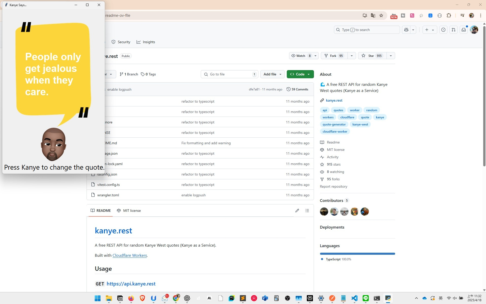

# 🎤 Kanye Quotes App

透過 Kanye West API，隨機生成 Kanye West 的經典名言，每天給你一點靈感與態度。

## 🚀 功能

- 點擊按鈕自動抓取 Kanye West 的名言
- 使用 Tkinter 提供視覺化介面
- 設計輕鬆、介面簡潔

## 🖥️ 執行畫面



## ⚙️ 安裝步驟

### 下載專案：

```bash
git clone https://github.com/henry-yen/kanye-quotes.git
cd kanye-quotes
pip install -r requirements.txt
```

### 執行專案：
```bash
python main.py
```

## 📁 專案結構

```text
kanye-quotes/
├── assets/
│   ├── background.png
│   └── kanye.png
├── main.py
├── requirements.txt
└── README.md
```

## 🔧 使用技術
-Python 3.12
-Tkinter GUI (Python 內建)
-Requests (發送 API 請求)

## ⚖️ 授權
本專案採用 MIT License。
© 2025 Henry Yen